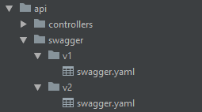

# swagger-express-mw API versioning
API versioning implementation with ExpressJS and Swagger using [swagger-express-mw](https://www.npmjs.com/package/swagger-express-mw) package.

# How to use?
(1) First, copy the `ApiVersioning.js` file into a folder in your project directory, e.g. `myCustomModules/ApiVersioning.js`

(2) Import the `ApiVersioning` module in the `index.js` file of your ExpressJS application.

```javascript
import ApiVersioning from "./myCustomModules/ApiVersioning";
```

(3) Create an instance of the `ApiVersioning` class where the first parameter of the constructor is the root path of your project and the second parameter (optional) is an object responsible for performing security operations, for example `token authentication`.

```javascript
const versioning = new ApiVersioning(__dirname);
```

(4) Create a directory named swagger inside the folder that ExpressJS created for your application.The idea is to create a swagger.yaml file for each API version as in the following image:



(5) The initial or default configuration of the [swagger-express-mw](https://www.npmjs.com/package/swagger-express-mw) module can be found in this repository in the `config/default.yaml` file, feel free to adapt it to your needs. 

(6) You must tell the `ApiVersioning` class the host, the port, and the path for each swagger file using the `generateSwaggerFile` method:

```javascript
const swaggerFile1 = ApiVersioning.generateSwaggerFile(host, port, './api/swagger/v1/swagger.yaml');
const swaggerFile2 = ApiVersioning.generateSwaggerFile(host, port, './api/swagger/v2/swagger.yaml');
```

(7) Finally, using the `createAppVersion` method set the path by which the documentation will be accessed from the browser.
```javascript
versioning.createAppVersion(app, swaggerFile1, '/api/v1', {
  swaggerUi: '/docs',
  apiDocs: '/swagger',
});
versioning.createAppVersion(app, swaggerFile2, '/api/v2', {
  swaggerUi: '/docs',
  apiDocs: '/swagger',
});
```